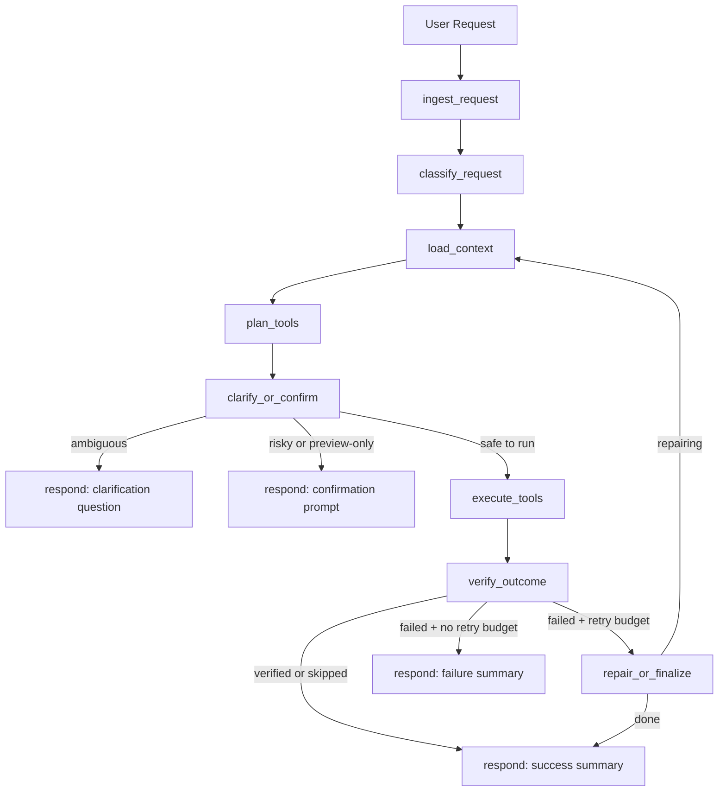

# oxView LangGraph Helper

## Overview

This folder contains a standalone TypeScript/Node LangGraph project that turns natural-language requests into validated oxView actions through **typed tool calls**.

The project is designed for requests such as:

- `color every odd nucleotide green`
- `change the color of nucleotide 12 to red`
- `select all the nucleotide 13`
- `focus on element 120`
- `what is the position of nucleotide 44`
- `what elements are currently selected`

The helper is intentionally **CLI-first** in v1. It does **not** embed a UI inside oxView. Instead, it connects to a **running oxView session** over the **Chrome DevTools Protocol (CDP)**, evaluates small helper functions inside the renderer page, and exposes those capabilities to a LangGraph workflow as structured tools.

That separation keeps the integration low-risk:

- the core oxView UI does not need to be re-architected
- the agent can evolve independently
- the same assistant can work with a running Electron app or a browser-hosted oxView page, as long as CDP is available

## Goals

The v1 helper is optimized for:

- safe, natural-language control of oxView
- typed tool use instead of free-form JavaScript generation
- verification after every mutating action
- visible error reporting from oxView APIs
- predictable behavior around ambiguity and destructive actions

The v1 helper is **not** optimized for:

- embedded chat UI inside the oxView app
- multi-user server deployment
- free-form arbitrary JavaScript execution without confirmation
- broad autonomous editing without user oversight

## Design Principles

1. **Use typed tools first**

The model should solve requests by composing typed tools like `find_elements`, `select_elements`, and `color_elements`. It should not default to raw JS.

2. **Ground before acting**

If a request depends on scene state, the graph loads a minimal snapshot first and lets the model plan with current context.

3. **Auto-execute only safe, reversible actions**

Selection changes, camera focusing, and non-destructive recoloring can run automatically when unambiguous.

4. **Require confirmation for risky actions**

Topology edits, destructive requests, or raw-JS fallback previews must be confirmed.

5. **Verify outcomes**

Mutating tools return structured results and the graph performs a readback pass to check for tool failure or oxView API errors.

6. **Never hide failures**

If something goes wrong, the graph surfaces the last API error and includes tool-level failure details in the final response.

## Directory Layout

```text
langGraph/
├── .env.example
├── package.json
├── tsconfig.json
├── README.md
├── src/
│   ├── cli/
│   │   └── chat.ts
│   ├── config/
│   │   └── env.ts
│   ├── graph/
│   │   └── buildGraph.ts
│   ├── runtime/
│   │   ├── cdpSession.ts
│   │   └── modelFacade.ts
│   ├── tools/
│   │   ├── catalog.ts
│   │   ├── pageHelpers.ts
│   │   └── schemas.ts
│   ├── index.ts
│   └── types.ts
└── test/
    ├── catalog.test.ts
    ├── graph.test.ts
    └── schemas.test.ts
```

## Runtime Architecture

The project is split into five layers.

### 1. CLI layer

`src/cli/chat.ts`

Responsibilities:

- load env/config
- connect to oxView via CDP
- instantiate the LangGraph workflow
- run an interactive chat loop
- handle confirmation prompts
- print final responses

### 2. Session/transport layer

`src/runtime/cdpSession.ts`

Responsibilities:

- connect to a running oxView page over CDP
- discover the correct page target
- evaluate expressions in the renderer
- install browser-side helper functions once per session
- expose `runHelper(helperName, input)` as the stable execution primitive

This layer is intentionally thin. It does not know anything about LLM prompts or graph logic. It only knows how to reach oxView and run code safely inside the page.

### 3. Browser helper layer

`src/tools/pageHelpers.ts`

Responsibilities:

- define reusable page-context helpers
- translate typed filters into actual oxView element ids
- map typed tool inputs to oxView’s `api.*`, `edit.*`, and renderer globals
- return structured JSON-safe results back to the Node process

This is the only place where the helper intentionally touches globals like:

- `api`
- `edit`
- `elements`
- `systems`
- `selectedBases`
- `clearSelection`
- `colorElements`
- `render`
- `editHistory`

### 4. Tool layer

`src/tools/catalog.ts`

Responsibilities:

- define the typed tool catalog exposed to the model
- bind zod schemas to each tool
- label tools as read-only or mutating
- translate tool invocations into page-helper calls

This is the formal contract between the model and oxView.

### 5. Graph/orchestration layer

`src/graph/buildGraph.ts`

Responsibilities:

- store request and execution state
- classify request safety and ambiguity
- fetch scene context
- ask the model to choose tools
- gate risky actions behind confirmation
- execute planned tools
- verify the outcome
- retry once if verification fails
- generate the final response

## Model Architecture

`src/runtime/modelFacade.ts`

The project uses a model facade instead of calling the LLM directly from graph nodes. This makes the workflow easier to test because tests can replace the model with a deterministic mock.

The facade currently supports:

- `classifyRequest(...)`
- `planWithTools(...)`
- `generateRawJsPreview(...)`

The production implementation uses `ChatOpenAI` from `@langchain/openai`.

### Why the facade matters

Without a facade:

- graph nodes would be tightly coupled to one provider
- tests would require live model calls
- retry/clarification logic would be harder to isolate

With a facade:

- the graph is provider-agnostic
- tests can mock classification and tool planning deterministically
- future provider swaps are localized

## State Model

The LangGraph state includes:

- `userRequest`: raw user text
- `normalizedRequest`: trimmed/normalized request
- `executionMode`: `safe-auto`, `always-preview`, or `always-execute`
- `confirmationGranted`: whether the user has approved execution
- `status`: running / needs_confirmation / needs_clarification / completed / failed / repairing
- `classification`: request safety/ambiguity classification
- `sceneSummary`: compact scene context
- `assistantReasoning`: planner explanation
- `directResponse`: model response when no tools are needed
- `clarificationQuestion`: question to ask when intent is ambiguous
- `confirmationPrompt`: preview shown before risky execution
- `rawJsPreview`: last-resort JS preview for unsupported requests
- `pendingToolCalls`: planned tool calls awaiting execution
- `toolResults`: structured results from executed tools
- `verification`: readback/verification result
- `repairAttempts`: retry count
- `finalResponse`: text returned to the user

## Filter Model

The key abstraction that makes requests like “every odd nucleotide” workable is the typed element filter.

Supported filter fields:

- `ids`
- `parity`
- `strandIds`
- `baseTypes`
- `selectedOnly`
- `elementKinds`
- `attributePredicate`
- `limit`

### Example filters

Odd nucleotides:

```json
{
  "parity": "odd",
  "elementKinds": ["nucleotide"]
}
```

Specific element ids:

```json
{
  "ids": [12]
}
```

Base-type filter:

```json
{
  "baseTypes": ["A", "G"],
  "elementKinds": ["nucleotide"]
}
```

Attribute predicate:

```json
{
  "attributePredicate": {
    "field": "label",
    "operator": "contains",
    "value": "scaffold"
  }
}
```

## Tool Catalog

### Read tools

- `get_scene_summary`
- `get_api_errors`
- `find_elements`
- `get_element_info`
- `get_distance`
- `get_center_of_mass`

### Mutating tools

- `select_elements`
- `clear_selection`
- `color_elements`
- `create_helix_bundle`
- `focus_element`
- `toggle_visibility`
- `show_everything`
- `toggle_base_colors`
- `undo`
- `redo`

## Why these tools exist

The tool set is intentionally slightly higher-level than oxView’s raw browser console surface.

For example:

- the agent does not need to manually build `api.getElements([...])`
- the agent does not need to manually traverse `elements.values()`
- the agent does not need to write ad hoc parity filters in JS

That makes planning more reliable and reduces unsafe fallback behavior.

## Graph Nodes

### `ingest_request`

Normalizes the request and initializes clean execution state.

### `classify_request`

Determines whether the request is:

- read-only
- safe mutation
- destructive mutation
- ambiguous

It combines heuristics with model output.

### `load_context`

Fetches a compact oxView scene summary so the model has enough grounding to plan without dumping the full scene.

### `plan_tools`

Calls the model with the available tool catalog and asks it to either:

- emit tool calls
- answer directly
- or, if no typed plan is available, produce a raw-JS preview

### `clarify_or_confirm`

Stops the graph before execution when:

- the request is ambiguous
- the execution mode requires preview
- the request is destructive
- or the planner had to fall back to a raw-JS preview

### `execute_tools`

Runs the tool calls in order and stores structured tool results.

### `verify_outcome`

Reads back oxView API errors and checks whether mutating tools succeeded.

### `repair_or_finalize`

If verification failed and retries remain, the graph performs one repair cycle by reloading context and re-planning.

### `respond`

Builds the final user-facing output:

- clarification request
- confirmation preview
- success summary
- or failure summary with verification details

## End-to-End Flow



## Confirmation Policy

### Auto-execute

Allowed for:

- read-only queries
- unambiguous selection changes
- unambiguous color changes
- non-destructive view/camera actions

### Confirm first

Required for:

- delete/skip/ligate/nick/split/insert/extend/create/set-sequence style edits
- ambiguous numeric references like `nucleotide 13`
- any raw-JS fallback preview

## Verification Strategy

After mutating tools run:

1. collect tool-level success/failure
2. query oxView API errors
3. if any tool failed, mark verification as failed
4. if oxView recorded an API error, mark verification as failed
5. retry once with updated context
6. if still failing, return a failure response with details

This means the graph never silently assumes a tool call worked.

## Worked Examples

### Example 1: `color every odd nucleotide green`

Likely flow:

1. classify as safe mutating
2. load scene summary
3. plan `color_elements` with a filter using `parity=odd` and `elementKinds=["nucleotide"]`
4. execute
5. verify no API error
6. return a success summary

### Example 2: `change the color of nucleotide 12 to red`

Likely flow:

1. classify
2. detect ambiguity if `nucleotide 12` could mean id or type
3. ask whether the user means element id 12 or type/base 12
4. once clarified, plan `color_elements`

### Example 3: `select all the nucleotide 13`

This is intentionally treated as ambiguous in v1.

Expected clarification:

`Do you mean element ID 13, or all nucleotides with type/base 13?`

## Configuration

Environment variables:

- `OPENAI_API_KEY`
- `OPENAI_BASE_URL`
- `OPENAI_MODEL`
- `OXVIEW_CDP_URL`
- `OXVIEW_EXECUTION_MODE`
- `OXVIEW_MAX_REPAIR_ATTEMPTS`

Default model endpoint:

- `https://nano-gpt.com/api/v1`

Default model:

- `zai-org/glm-5.1:thinking`

Default execution mode:

- `safe-auto`

## Running Locally

1. From the repo root, install the helper dependencies:

```bash
npm run langgraph:install
```

2. Start oxView with CDP enabled:

```bash
npm run start:cdp
```

3. Review `langGraph/.env` or copy `.env.example` to `.env` if you want different credentials or a different model.
4. Run the CLI from the repo root:

```bash
npm run langgraph:chat
```

Direct package-local commands still work too:

```bash
cd langGraph
npm install
npm run chat
```

5. Type requests like:

```text
color every odd nucleotide green
focus on element 120
what is the backbone position of element 44
```

## Testing

Run the lightweight mocked test suite:

```bash
npm run langgraph:test
```

Run a build:

```bash
npm run langgraph:build
```

## Current Limitations

- V1 does not embed a chat UI inside oxView.
- V1 assumes a CDP-reachable oxView page.
- V1 supports only one repair loop.
- V1 treats numbered “nucleotide N” phrases conservatively and may ask for clarification.
- V1 raw-JS generation is preview-only and never auto-executes.

## Extension Path

Good next steps after v1:

- embed the assistant into oxView’s Electron UI
- add a lightweight HTTP or WebSocket service mode
- add richer domain filters like strand length or spatial region
- support batch operations with staged previews
- support multi-turn clarification state persistence

## Why this architecture should feel seamless

The user experience is intended to feel seamless because the agent:

- reasons over a compact live scene summary
- uses typed tools instead of brittle generated code
- can filter elements in domain-native ways
- verifies the effect of each action
- asks for confirmation only when the request is risky or ambiguous
- exposes oxView API failures directly instead of hiding them

That combination makes the helper both useful and predictable, which is critical for a scene-editing assistant.
